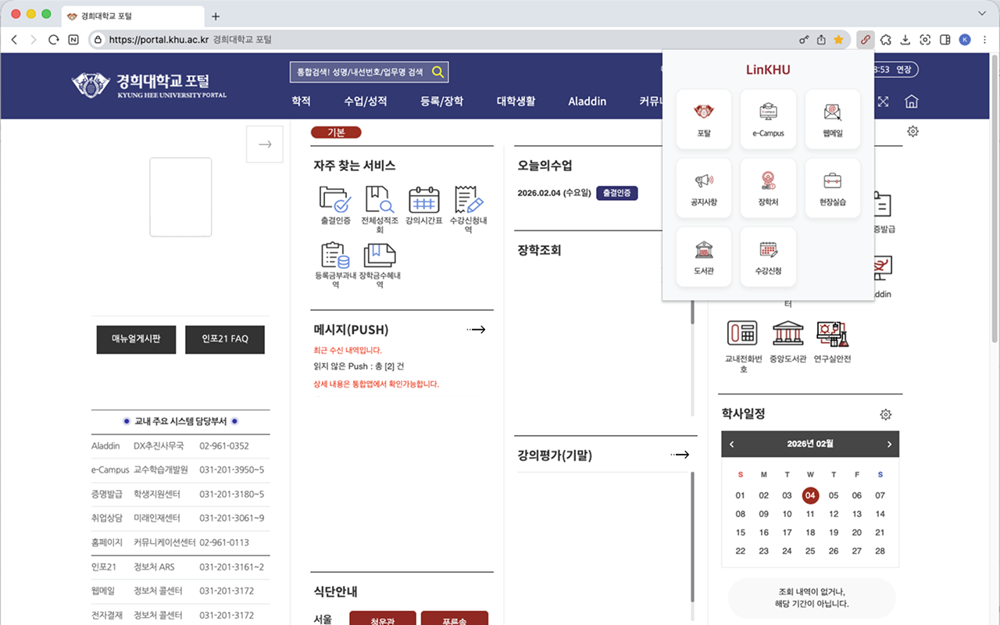
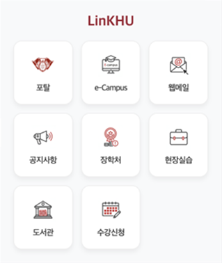
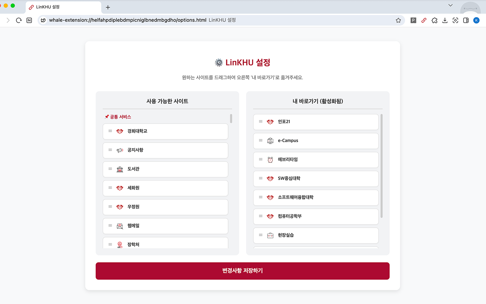

# LinKHU

경희대학교 학생들이 자주 사용하는 핵심 웹서비스들을 클릭 한 번으로 즉시 이동하세요.  

## 🔗 경희대학교 자주 찾는 웹서비스 바로가기 제공
### 🏫 지원 웹서비스

자세히 보기

[공통] 경희대학교, 세화원, 우정원, 정보처, 제2기숙사, 행복기숙사, SW중심대학사업단 
[단과대] 간호과학대학, 경영대학, 공과대학, 국제대학, 무용학부, 문과대학, 미술대학, 법과대학, 생명과학대학, 생활과학대학, 소프트웨어융합대학, 약학대학, 예술디자인대학, 외국어대학, 융합전공, 음악대학, 응용과학대학, 의과대학, 이과대학, 전자정보대학, 정경대학, 체육대학, 치과대학, 한의과대학, 호텔관광대학, 후마니타스칼리지 
[학과/전공] 4D아트융합전공, 건축공학과, 건축학과, 경제학과, 과학지능정보융합전공, 국어국문학과, 국제통상금융투자학부, 글로벌리더/비즈니스전공, 글로벌문화기술융합전공, 글로벌엔지니어링융합전공, 글로벌커뮤니케이션학부, 기계공학부, 도예학과, 동서의과학과, 디지털콘텐츠학과, 러시아어학과, 무역학과, 물리학과, 미디어학과, 미래정보디스플레이학부, 사학과, 사회과학융합전공, 사회기반시스템공학과, 사회학과, 산업경영공학과, 산업디자인학과, 생물학과, 생체의공학과, 소프트웨어융합학과, 수학과, 스마트팜과학과, 스페인어학과, 시각디자인학과, 식물환경신소재공학과, 식품생명공학과, 신소재공학과, 실감미디어융합전공, 아크&테크놀러지융합전공, 연극영화과, 영어영문학과, 우주과학과, 원예생명공학과, 원자력공학과, 유전생명공학과, 융합바이오신소재공학과, 응용물리학과, 응용수학과, 응용영어통번역학과, 응용화학과, 의류디자인학과, 일본어학과, 자율전공학부, 전자정보공학부, 정치외교학과, 중국어학과, 지리학과, 철학과, 컴퓨터공학부, 포스트모던음악학과, 프랑스어학과, 한국어학과, 한방생명공학과, 행정학과, 화학공학과, 화학과, 환경조경디자인학과, 환경학및환경공학과, K퍼포밍아트융합전공

## 👀 미리보기

|                                  실행 화면                                   |                                 팝업 화면                                 |
| :--------------------------------------------------------------------------: | :-----------------------------------------------------------------------: |
|          |  |
|                                  설정 화면                                   |                                                                           |
|  |                                                                           |

## 🚀 설치 방법

### 방법 1: Chrome 웹 스토어
1. [Chrome 웹 스토어 링크](https://chromewebstore.google.com/detail/ihidkmjkpfphgljieecfcikljaopcldp)에 접속합니다.
2. "Chrome에 추가" 버튼을 클릭합니다.
3. 확장 앱을 브라우저에 고정해 두고 사용하면 더욱 편리합니다.

### 방법 2: 수동 설치
1. 이 저장소를 `git clone` 하거나 ZIP으로 다운로드하여 압축을 풉니다.
2. 크롬 브라우저 주소창에 `chrome://extensions`를 입력하여 이동합니다.
3. 우측 상단의 '개발자 모드'를 켭니다.
4. '압축해제된 확장 프로그램을 로드합니다' 버튼을 클릭합니다.
5. 다운로드 받은 폴더 내 src 폴더를 선택합니다.
6. 확장 앱을 브라우저에 고정해 두고 사용하면 더욱 편리합니다.

## 🐛 버그 제보 및 기여
사이트 추가 또는 서비스 개선 등 Issue와 Pull Request를 통한 버그 제보 및 새로운 기능 제안은 언제나 환영입니다!

## 📜 License
This project is licensed under the [MIT License](./LICENSE)  
