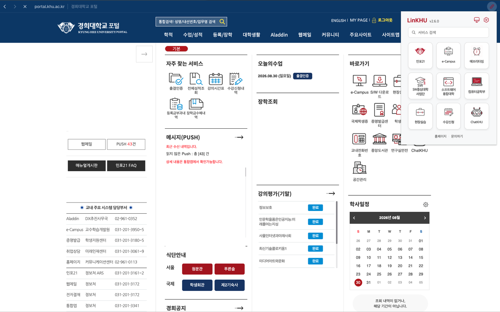
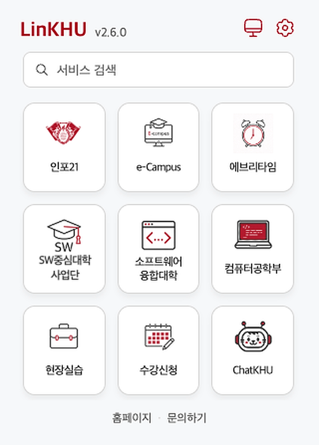
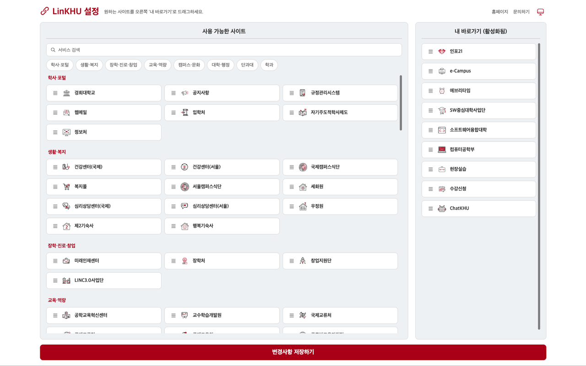

**한국어** | [English](./README.en.md)

# LinKHU

경희대학교 학생들이 자주 사용하는 핵심 웹서비스들을 클릭 한 번으로 즉시 이동하세요.

🏠 홈페이지: https://kangkyunghyun.github.io/LinKHU/

<p>
  <a href="https://github.com/kangkyunghyun/LinKHU/releases/latest"></a>
  <a href="./LICENSE"></a>
  <a href="https://github.com/kangkyunghyun/LinKHU/actions/workflows/validation.yml"></a>
  <a href="https://chromewebstore.google.com/detail/ihidkmjkpfphgljieecfcikljaopcldp"></a>
  <a href="https://chromewebstore.google.com/detail/ihidkmjkpfphgljieecfcikljaopcldp"></a>
  <a href="https://chromewebstore.google.com/detail/ihidkmjkpfphgljieecfcikljaopcldp"></a>
  <a href="https://addons.mozilla.org/ko/firefox/addon/linkhu"></a>
  <a href="https://addons.mozilla.org/ko/firefox/addon/linkhu"></a>
  <a href="https://addons.mozilla.org/ko/firefox/addon/linkhu"></a>
</p>

[](https://chromewebstore.google.com/detail/ihidkmjkpfphgljieecfcikljaopcldp)
[](https://store.whale.naver.com/detail/njhgalaophlilmhapklabocladclmhoc)
[](https://addons.mozilla.org/ko/firefox/addon/linkhu)

## 🔗 경희대학교 자주 찾는 웹서비스 바로가기 제공
### 🏫 지원 웹서비스
총 117개 서비스를 지원합니다.

- 공통 서비스 23개
- 단과대 26개
- 학과/전공 68개

전체 목록은 [Supported Services](./docs/supported-services.md)에서 확인할 수 있습니다.

### 🔎 팝업 검색

팝업 상단 검색창에서 서비스 이름, ID, 카테고리로 원하는 바로가기를 찾을 수 있습니다.

- `/` 키를 누르면 검색창으로 바로 이동합니다.
- 이름이 일치하는 서비스가 먼저 표시되고, `Enter`를 누르면 첫 번째 결과를 현재 탭에서 엽니다.
- 검색어가 없을 때는 설정 페이지에서 저장한 내 바로가기 목록이 표시됩니다.

### 💬 문의하기

팝업과 설정 페이지 하단의 **문의하기**에서 GitHub 계정 없이 바로 의견을 보낼 수 있습니다. 답변이 필요하면 이메일을 함께 남길 수 있습니다.

## 👀 미리보기

|                                  실행 화면                                   |                                 팝업 화면                                 |
| :--------------------------------------------------------------------------: | :-----------------------------------------------------------------------: |
|          |  |
|                                  설정 화면                                   |                                                                           |
|  |                                                                           |

## 🚀 설치 방법

### 방법 1: Chrome 웹 스토어
1. [Chrome 웹 스토어 링크](https://chromewebstore.google.com/detail/ihidkmjkpfphgljieecfcikljaopcldp)에 접속합니다.
2. "Chrome에 추가" 버튼을 클릭합니다.
3. 확장 앱을 브라우저에 고정해 두고 사용하면 더욱 편리합니다.

### 방법 2: 수동 설치
1. 이 저장소를 `git clone` 하거나 ZIP으로 다운로드하여 압축을 풉니다.
2. 크롬 브라우저 주소창에 `chrome://extensions`를 입력하여 이동합니다.
3. 우측 상단의 '개발자 모드'를 켭니다.
4. '압축해제된 확장 프로그램을 로드합니다' 버튼을 클릭합니다.
5. 다운로드 받은 폴더 내 src 폴더를 선택합니다.
6. 확장 앱을 브라우저에 고정해 두고 사용하면 더욱 편리합니다.

## ⌨️ 단축키

LinKHU 팝업은 기본 단축키로 빠르게 열 수 있습니다.

- Windows/Linux: `Ctrl + Shift + L`
- macOS: `Command + Shift + L`

브라우저나 다른 확장 프로그램의 단축키와 충돌하면 기본 단축키가 동작하지 않을 수 있습니다. 이 경우 브라우저 확장 프로그램 단축키 설정 화면에서 LinKHU 단축키를 직접 다시 지정해주세요.

- Chrome: `chrome://extensions/shortcuts`
- Whale: `whale://extensions/shortcuts`
- Firefox: `about:addons` → 톱니바퀴 메뉴 → 확장 기능 단축키 관리

## 🛠 개발 및 패키징

```bash
npm test
npm run validate:data
npm run generate:landing-data
npm run package
npm run build
```

- `npm test`: 팝업/설정의 핵심 동작, 데이터 검증, 재현 가능한 패키징을 테스트합니다.
- `npm run validate:data`: `src/data.js`의 사이트 데이터를 검증합니다.
- `npm run generate:landing-data`: `src/data.js`를 기준으로 랜딩 페이지 검색 데이터와 서비스 아이콘을 갱신합니다.
- `npm run package`: `src/`를 `dist/linkhu-v{manifest.version}.zip`으로 패키징합니다.
- `npm run build`: 테스트, 사이트 데이터와 랜딩 검색 데이터 동기화 검증 후 패키징까지 한 번에 실행합니다.

## 📁 프로젝트 구조

- `src/`: 확장 프로그램 소스
- `src/data.js`: 지원 서비스 목록
- `src/images/`: 카테고리별 서비스 아이콘
- `docs/index.html`: GitHub Pages용 정적 랜딩 페이지
- `scripts/`: 데이터 검증, 패키징, 스토어 배포 스크립트
- `.github/workflows/`: 검증, 릴리스, 스토어 배포 자동화
- `docs/`: 배포/운영 문서
- `docs/assets/`: README와 스토어용 이미지
- `release-notes/`: 버전별 릴리스 노트

## 🚢 릴리스

릴리스 준비 PR에서 `src/manifest.json`의 `version`을 수정하고 `release-notes/v{version}.md`를 작성한 뒤 `main`에 머지합니다. 이후 같은 버전 태그를 push하면 GitHub Release가 자동 생성됩니다.

```bash
git switch main
git pull --ff-only
VERSION=$(node -p "require('./src/manifest.json').version")
git tag "v$VERSION"
git push origin "v$VERSION"
```

릴리스 워크플로우는 `npm run build`로 패키징한 ZIP 파일을 첨부하고, `release-notes/v{version}.md` 내용을 릴리스 노트로 사용합니다.

스토어 배포는 [스토어 배포 체크리스트](./docs/store-release-checklist.md)를 따릅니다.
Chrome Web Store 자동 배포는 [Chrome Web Store Automation](./docs/chrome-web-store-automation.md)을 따릅니다.
Firefox Add-ons 자동 배포는 [Firefox Add-ons Automation](./docs/firefox-addons-automation.md)을 따릅니다.
Whale Store 배포는 [Whale Store Automation Research](./docs/whale-store-automation.md)에 따라 수동 절차를 유지합니다.
스토어 설명은 [Store Listing](./docs/store-listing.md)을 원본으로 관리합니다.
팝업/설정 페이지의 문의 기능 연결은 [문의 채널 설정 가이드](./docs/feedback-setup.md)를 따릅니다.

## 🐛 버그 제보 및 기여

Issue와 Pull Request를 통한 제보와 기여는 언제나 환영입니다.

- 버그 제보: Bug Report 템플릿을 사용해주세요.
- 지원 웹 서비스 추가 요청: Service Request 템플릿에 서비스 이름, URL, 카테고리, 아이콘 정보를 적어주세요.
- 기능 제안: Feature Request 템플릿에 제안 배경과 기대 동작을 적어주세요.
- 직접 수정 PR: 관련 이슈를 먼저 만들고, 변경 후 검증 결과를 PR 본문에 남겨주세요.

## 📜 License
This project is licensed under the [MIT License](./LICENSE)  
