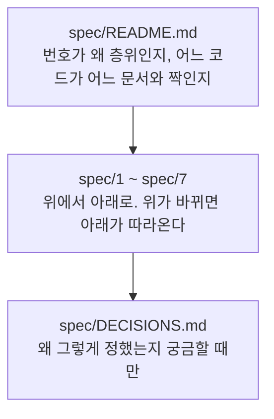

# LinKHU 문서

LinKHU의 현재 동작과 그렇게 정한 이유, 그리고 운영 절차를 기록한다.

기억하지 말고 기록한다. 논의와 결정을 문서로 남겨, 다음 작업에서 에이전트가 스펙과 당시 결정을 찾아오면 그 맥락 위에서 다음 결정을 할 수 있게 한다.

## 문서 상태

| 폴더 | 담는 것 | 언제 쓰는가 |
|---|---|---|
| [`spec/`](spec/README.md) | 배경·요구사항·설계·계약·구현 규약·운영 | 코드를 바꿀 때마다 **함께 갱신한다** |
| [`spec/DECISIONS.md`](spec/DECISIONS.md) | 검토한 선택지와 결정 이유 | 설계 방향을 정하거나 바꿀 때 **덧붙인다** |
| [`guides/`](guides/README.md) | 릴리스·스토어 배포·아이콘 운영 절차 | 절차가 바뀔 때 |
| [`copy/`](copy/README.md) | 스토어·커뮤니티 문구 원본 | 릴리스마다 |
| [`releases/`](releases) | 버전별 릴리스 노트 | 릴리스마다. 낸 뒤에는 고치지 않는다 |

`spec/`이 **현재**이고 `DECISIONS.md`가 **과거**다. 스펙은 코드와 함께 계속 갱신되고, 결정 기록은 쓴 뒤 고치지 않고 뒤에 덧붙인다. 둘이 어긋나면 스펙이 현재다.

## 읽는 순서

스펙 안쪽의 층위 규칙과 읽는 순서는 [`spec/README.md`](spec/README.md)가 원본이다. 작업 절차(이슈·브랜치·커밋·PR)는 [`AGENTS.md`](../AGENTS.md)가 원본이다.

## 문서와 책임

| 문서 | 책임 |
|---|---|
| [스펙](spec/README.md) | 현재 구조와 동작, 계층 번호와 코드↔스펙 대응 |
| [결정 기록](spec/DECISIONS.md) | 검토한 선택지와 결정 이유 |
| [운영 가이드](guides/README.md) | 운영 절차의 읽는 순서와 책임 |
| [배포 문구](copy/README.md) | 스토어·커뮤니티 문구의 읽는 순서와 책임 |
| [1-RELEASE-PROCESS.md](guides/1-RELEASE-PROCESS.md) | 릴리스 준비부터 스토어 배포까지 |
| [2-1-STORE-RELEASE-CHECKLIST.md](guides/2-1-STORE-RELEASE-CHECKLIST.md) | 스토어별 제출 절차 |
| [2-2-CHROME-WEB-STORE.md](guides/2-2-CHROME-WEB-STORE.md) | Chrome 자동 배포 |
| [2-3-FIREFOX-ADDONS.md](guides/2-3-FIREFOX-ADDONS.md) | Firefox 자동 배포 |
| [2-4-WHALE-STORE.md](guides/2-4-WHALE-STORE.md) | Whale 수동 배포 |
| [3-FEEDBACK-SETUP.md](guides/3-FEEDBACK-SETUP.md) | 문의 채널(Google Form) 연결 |
| [4-1-ICON-STYLE-GUIDE.md](guides/4-1-ICON-STYLE-GUIDE.md) | 서비스 아이콘 도안 규칙 |
| [4-2-SCREENSHOT-GUIDE.md](guides/4-2-SCREENSHOT-GUIDE.md) | 스크린샷 촬영 기준 |
| [1-1-STORE-LISTING.md](copy/1-1-STORE-LISTING.md) | 스토어 설명 원본 |
| [1-2-COMMUNITY-POST.md](copy/1-2-COMMUNITY-POST.md) | 커뮤니티 홍보글 원본 |
| [supported-services.md](supported-services.md) | 지원 서비스 목록 (생성물) |

GitHub Pages 랜딩은 [`landing/`](../landing)에 있다. 이 폴더는 사이트로 배포되지 않는다.

## 변경 원칙

1. 스펙은 코드와 함께 갱신한다 (MUST). 어느 코드가 어느 문서와 짝인지는 [`spec/README.md`의 대응표](spec/README.md)가 정한다.
2. 결정 기록은 쓴 뒤 고치지 않는다 (MUST). 결정이 바뀌면 새 번호로 덧붙이고 옛 항목의 상태만 바꾼다.
3. 작업 절차는 [AGENTS.md](../AGENTS.md)를 따른다 (MUST). 이 문서에서 반복하지 않는다.
