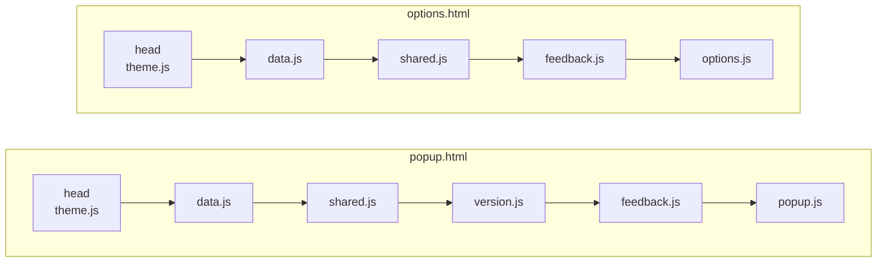

# 4-3. 소프트웨어 아키텍처

LinKHU가 어떤 조각으로 나뉘고 그 조각들이 어떻게 연결되는지를 기술한다. 빌드 단계가 없으므로 "모듈 그래프"가 아니라 **HTML의 스크립트 로드 순서와 전역 객체**가 결합 방식이다. 이 특성을 모르면 파일을 옮기거나 `import`를 도입하려다 화면을 깨뜨린다.

```text
§4-3-1   3개 화면            popup, options, landing의 경계
§4-3-2   스크립트 결합 방식     전역 객체와 로드 순서
§4-3-3   공용 유틸            shared.js가 보장하는 것
```

## 4-3-1 3개 화면

| 화면 | 진입점 | 실행 환경 | 역할 |
| --- | --- | --- | --- |
| 팝업 | `src/popup.html` | 확장 팝업 | 내 바로가기 표시, 검색, 이동 |
| 설정 | `src/options.html` | 탭 (`open_in_tab: true`) | 내 바로가기 선택과 정렬 |
| 랜딩 | `landing/index.html` | GitHub Pages | 제품 소개, 지원 서비스 검색 |

팝업과 설정은 확장 컨텍스트에서 실행되므로 `chrome.*` API를 쓴다. 랜딩은 **일반 웹페이지**이므로 `chrome.*`를 쓸 수 없고 확장의 파일도 참조할 수 없다.

이 경계가 아키텍처의 가장 중요한 제약이다. 확장과 랜딩은 코드를 공유할 수 없고, **같은 규칙을 각자 구현한 뒤 테스트로 일치를 강제**한다. 백그라운드 스크립트나 서비스 워커는 없다. 모든 로직이 화면 스크립트 안에 있다.

## 4-3-2 스크립트 결합 방식

번들러가 없으므로 각 스크립트는 전역 객체를 노출하고, HTML이 순서대로 로드해 결합한다.



`theme.js`만 `<head>`에서 동기 로드한다. 테마 표식을 첫 페인트 전에 붙여야 하기 때문이다. 나머지는 본문 뒤에서 로드한다.

| 파일 | 노출하는 전역 | 책임 |
| --- | --- | --- |
| `theme.js` | `ThemeManager` | 테마 모드 해석·저장·적용 |
| `data.js` | `MASTER_SITE_LIST` | 지원 서비스 배열 |
| `shared.js` | `LinKHUShared` | 검색 정규화·점수·정렬, 기본 순서 |
| `version.js` | `VersionManager` | 현재 버전 표시, 최신 릴리스 비교, 스토어 링크 |
| `feedback.js` | `Feedback` + `initFeedbackForm` | 문의 폼 전송과 화면 와이어링 |
| `popup.js` / `options.js` | (없음) | 각 화면의 진입점 |

ES 모듈로 전환하지 않고 classic script를 유지한다. 검증 스크립트와 테스트 하네스가 이 로딩 방식에 묶여 있다.

**의존 대상은 반드시 자신보다 먼저 로드되어야 한다**. `popup.js`는 `MASTER_SITE_LIST`와 `LinKHUShared`가 이미 정의되어 있다고 가정하고 실행된다.

`shared.js`, `version.js`, `feedback.js`, `landing/landing.js`는 끝에 `module.exports` 가드를 둔다. 브라우저에서는 무시되고 Node 테스트에서는 `require`로 불러올 수 있게 하기 위한 장치다. 새 공용 모듈을 추가할 때도 같은 패턴을 따른다.

문의 폼은 팝업과 설정이 **같은 요소 id를 쓴다**. `feedback.js`가 `DOMContentLoaded`에서 한 번 와이어링하므로, 각 화면이 따로 구현하지 않는다.

## 4-3-3 공용 유틸

`LinKHUShared`(`src/shared.js`)는 팝업과 설정이 함께 쓰는 검색·정렬 규칙을 담는다.

| 함수 | 보장하는 것 |
| --- | --- |
| `normalize(value)` | `ko-KR` 기준 소문자화 + 모든 공백 제거 |
| `scoreSite(site, q)` | 0~4 점수. 낮을수록 상위. 해당 없으면 `Infinity` |
| `rankSites(sites, q)` | 점수 오름차순, 동점이면 원본 배열 순서 유지 |
| `getDefaultOrder(list)` | 기본 목록(`DEFAULT_SITE_IDS`) 중 `list`에 있는 서비스의 id 배열. 이름 `ko-KR` 가나다순 |

`rankSites`는 동점 처리에 원본 인덱스를 쓴다. 정렬이 안정적이지 않으면 같은 검색어에 결과 순서가 달라진다.

랜딩의 `landing/landing.js`는 같은 규칙을 `normalizeSearchText`, `scoreService`, `searchServices`로 따로 구현한다. **검색 규칙을 바꿀 때는 양쪽을 함께 바꿔야 한다**. 두 구현의 결과 일치는 테스트로 고정되어 있다 (7-2 테스트 케이스 참고).
