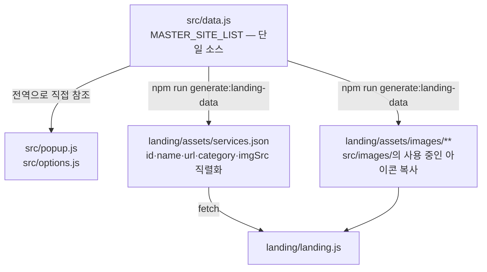

# 5. 계약

이 문서는 LinKHU가 **자기 바깥과 주고받기로 약속한 것**을 모은다. 안에서 어떻게 구현하든 이 약속을 어기면 상대가 깨진다.

LinKHU의 카운터파트는 셋이다. 확장이 부르는 외부 API 둘(GitHub, Google Forms)과, 확장이 생성해 랜딩에 넘기는 산출물이다. 서버가 없으므로 자체 API는 없고, 따라서 여기에 적히는 것은 **우리가 통제할 수 없는 상대와의 약속**과 **두 화면이 코드를 공유할 수 없어 생긴 약속**뿐이다.

**실패했을 때의 동작은 여기 적지 않는다** (MUST). 계약은 주고받기로 한 모양이고, 그 모양이 오지 않았을 때 화면이 무엇을 하는지는 §7-1 오류 처리가 정한다.

```text
§5-1   랜딩 파생 산출물     data.js에서 랜딩까지
§5-2   GitHub 릴리스 API   최신 버전 조회
§5-3   Google Forms       문의 전송
§5-4   공통 원칙           새 외부 연동을 추가할 때
```

## 5-1 랜딩 파생 산출물

`src/data.js`가 서비스 정보의 단일 소스이고, 랜딩이 쓰는 데이터는 여기서 **생성된 파생물**이다. 손으로 고치는 순간 두 곳이 어긋난다.



`services.json`은 다섯 필드를 그대로 직렬화한 배열이다. 여섯 번째 필드를 넣지 않는다 (MUST) — §6-2-1의 스키마가 그대로 계약이다.

```json
[
  {
    "id": "info21",
    "name": "인포21",
    "url": "https://portal.khu.ac.kr",
    "category": "학사·포털",
    "imgSrc": "images/common/portal.png"
  }
]
```

- `landing/assets/services.json`과 `landing/assets/images/`는 **생성물이다. 직접 수정하지 않는다** (MUST).
- 생성 스크립트는 사용 중인 아이콘만 복사하고, 더 이상 쓰이지 않는 복사본은 삭제한다.
- `npm run validate:landing-data`(`--check`)가 산출물이 최신인지 검사하며, `npm run build`에 포함되어 있다. 데이터를 바꾸고 생성을 잊으면 CI가 막는다.

랜딩은 검색어가 없을 때 `DEFAULT_SERVICE_IDS`(`info21`, `ecampus`, `sugang`) 세 개를 보여주고, 검색 결과는 최대 5개로 제한한다. 이 값들은 랜딩 전용 표시 규칙이며 확장 팝업과 무관하다.

**확장과 랜딩이 코드를 공유할 수 없다는 제약**(§4-3-1)이 이 계약을 만든다. 같은 이유로 검색 랭킹과 릴리스 노트 필터가 각각 두 벌로 존재하고, 두 구현의 결과 일치를 테스트가 강제한다 (§7-2).

## 5-2 GitHub 릴리스 API

| 항목 | 값 |
| --- | --- |
| 주소 | `https://api.github.com/repos/kangkyunghyun/LinKHU/releases/latest` |
| 부르는 곳 | 확장 `src/version.js`, 랜딩 `landing/landing.js` |
| 목적 | 최신 릴리스 버전 조회, 랜딩의 변경 이력 표시 |

응답에서 **실제로 읽는 필드는 넷뿐이다.** 나머지는 받아도 쓰지 않는다.

| 필드 | 쓰는 곳 | 없으면 |
| --- | --- | --- |
| `tag_name` | 확장의 버전 비교, 랜딩의 릴리스 제목 | 확장은 비교를 건너뛴다. 랜딩은 `name`으로 대체 |
| `name` | 랜딩의 릴리스 제목 대체값 | 빈 제목 |
| `published_at` | 랜딩의 릴리스 날짜 | 날짜를 비운다 |
| `body` | 랜딩의 변경 내용 | 빈 본문 |

```text
GET https://api.github.com/repos/kangkyunghyun/LinKHU/releases/latest

200 {
  "tag_name": "v2.8.0",
  "name": "v2.8.0",
  "published_at": "2026-09-13T00:00:00Z",
  "body": "### Features\n- ...\n\n### Internal\n- ..."
}
```

확장은 `tag_name`에서 앞의 `v`를 떼고 매니페스트 버전과 비교한다. `body`의 `### Internal` 절은 사용자에게 보이지 않아야 하므로 랜딩이 걸러낸다.

- 호스트 권한은 이 **단 하나의 URL**로 좁혀 두었다. 근거는 DECISIONS 1-3에 있다.
- 확장의 조회는 12시간 캐싱한다 (MUST). rate limit에 걸리면 모든 사용자의 버전 안내가 동시에 실패한다.
- 랜딩의 캐시는 `sessionStorage`에 탭 세션 단위로 둔다. 비인증 한도가 방문자 IP 기준 60회/시간인데 **학내망은 NAT로 IP를 공유하므로 한도가 집단으로 소진될 수 있다.**
- 응답 `body`는 **신뢰 경계 밖이다** (MUST). `innerHTML`로 붙이지 않고 `createElement`와 `textContent`로만 조립한다. 근거와 나머지 세 규칙(`### Internal` 거르기, 마크다운 파서 없음, 실패 시 섹션 감춤)은 DECISIONS 5-3에 있다.

## 5-3 Google Forms

| 항목 | 값 |
| --- | --- |
| 주소 | Google Forms `formResponse` 엔드포인트 |
| 부르는 곳 | 확장 `src/feedback.js`, 랜딩 |
| 목적 | 팝업·설정·랜딩 세 경로의 문의를 폼 하나로 수집 |

보내는 필드는 둘이고, **채워야 하는 값과 비어도 되는 값이 갈린다.**

| 필드 | 내용 | 필수 |
| --- | --- | --- |
| `entry.1096769292` | 문의 본문 | **필수.** 비면 보내지 않는다 |
| `entry.491031779` | 답변받을 이메일 | 선택. 비면 답변 없이 접수된다 |

```text
POST .../formResponse   (mode: "no-cors")
entry.1096769292=경영대 홈페이지 주소가 바뀌었습니다
entry.491031779=            ← 비워도 된다
```

이메일 질문 id를 설정에서 비워 두면 입력란 자체가 숨겨지므로, 이메일을 받지 않는 구성으로도 운영할 수 있다.

- Google Forms가 CORS 응답 헤더를 주지 않으므로 `mode: "no-cors"`로 보낸다. 응답 본문을 읽을 수 없으므로 **네트워크 오류가 없으면 전송된 것으로 간주한다**. 이 한계를 전제로 성공 문구를 정한다.
- 폼 주소와 필드 id는 **공개돼도 안전한 값**이다. 노출되어도 남이 할 수 있는 일은 폼에 응답을 넣는 것뿐이다. 근거는 DECISIONS 1-5에 있다.
- 확장과 랜딩이 같은 폼·같은 필드를 쓰는지는 테스트로 고정한다.
### 폼이 만족해야 하는 조건

질문 구성과 설정이 아래와 달라지면 **전송이 조용히 실패한다.** 폼을 만들거나 고칠 때 이 표가 계약이다.

| 항목 | 값 | 어기면 |
| --- | --- | --- |
| 질문 1 | **장문형** `문의 내용`, **필수** (MUST) | 필수가 아니면 외부에서 온 빈 요청이 그대로 저장된다 |
| 질문 2 | **단답형** `답변 받을 이메일`, 필수 아님 | — |
| 설정 탭의 "이메일 주소 수집" | **사용 안 함** (MUST) | 익명 전송이 필수 필드 누락으로 저장되지 않는다 |

질문 1이 필수가 아닐 때 왜 위험한지가 이 계약의 핵심이다. `formUrl`은 공개 페이지의 JS에 그대로 있어 **누구나 `formResponse`에 직접 POST할 수 있고**, 필수가 아니면 Google이 빈 요청을 그대로 받는다. 확장과 랜딩이 빈 값을 막아도 그 경로는 우회된다. 실제로 응답 9개 중 8개가 빈 채로 쌓인 적이 있다(이슈 [#194](https://github.com/kangkyunghyun/LinKHU/issues/194)).

### 확장에 연결하는 값

`src/feedback.js`의 `FEEDBACK_CONFIG`가 세 값을 갖는다. 랜딩도 같은 값을 쓴다 (MUST).

```js
const FEEDBACK_CONFIG = {
  formUrl: "https://docs.google.com/forms/d/e/<폼 ID>/formResponse",
  messageEntry: "entry.1096769292",
  emailEntry: "entry.491031779",   // 이메일 질문이 없으면 "" 유지
};
```

값은 폼 편집 화면의 ⋮ → **미리 채워진 링크 받기**로 얻는다. 받은 URL에서 `viewform`을 `formResponse`로 바꾼 것이 `formUrl`이고, `entry.*` 파라미터가 각 질문의 id다.

설정 전까지 문의 버튼을 누르면 **문의 채널 미준비 안내**가 표시된다 (MUST). `emailEntry`가 비어 있으면 이메일 입력란이 화면에 나타나지 않는다.

### 조용히 실패하는 것들

응답 본문을 읽을 수 없으므로 **아래가 모두 오류 없이 잘못된 결과만 남긴다.** 화면에는 전송 완료 안내가 뜬다.

| 잘못된 것 | 결과 | 잡는 법 |
| --- | --- | --- |
| entry ID 오타 | 응답이 저장되지 않거나 빈 채로 저장 | §7-2-5 테스트 전송과 라이브 폼 점검 |
| `문의 내용`이 필수가 아님 | 외부에서 온 빈 요청이 그대로 저장 | §7-2-5 라이브 폼 점검 |
| "이메일 주소 수집" 켜짐 | 익명 전송이 저장되지 않음 | §7-2-5 테스트 전송 |

**설정을 바꿀 때마다 §7-2-5를 함께 돌린다** (MUST).

### 응답을 받는 쪽

폼의 **응답** 탭 → ⋮ → **새 응답에 대한 이메일 알림 받기**를 켜 두면 문의가 들어올 때 폼 소유자에게 메일이 온다. **이 알림에는 문의 내용이 담기지 않는다** — 새 응답 안내와 링크뿐이며 설정으로 바꿀 수 없다. 내용까지 메일로 받으려면 Apps Script 트리거를 걸어야 하지만 **하지 않아도 된다** (MAY). 응답은 폼과 연결된 시트에 그대로 쌓이므로 유실되지 않는다.

## 5-4 공통 원칙

- **비밀 키가 필요한 방식은 채택할 수 없다** (MUST). 확장은 소스가 공개되므로 어떤 비밀값도 숨길 수 없다.
- 두 통신 모두 실패가 화면 사용을 막지 않아야 한다 (MUST). 바로가기를 여는 것이 제품의 본체이고, 외부 호출은 전부 부가 기능이다.
- 새 외부 호출을 추가할 때는 네 가지를 같은 기준으로 적용한다 (MUST) — 사용자에게 보일 것만 거르기, 파서 같은 의존성 늘리지 않기, 응답을 신뢰 경계 밖으로 다루기, 실패 시 조용한 폴백.
