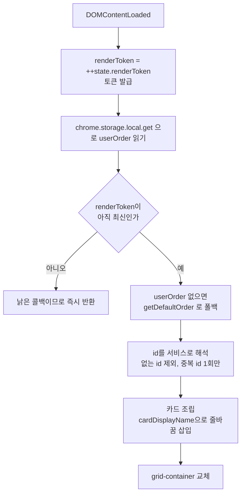
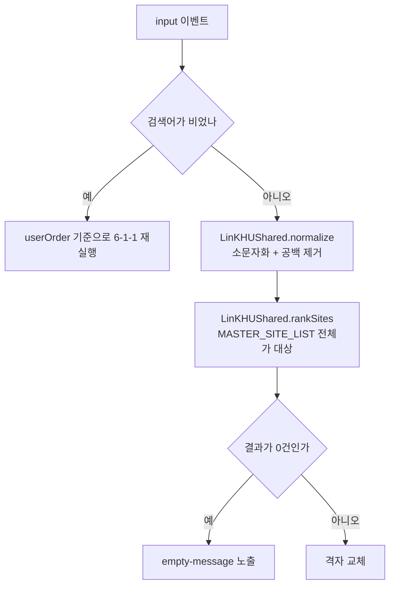
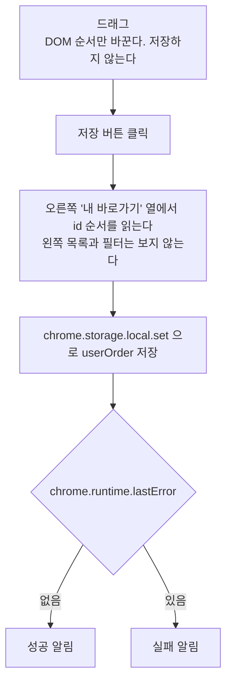
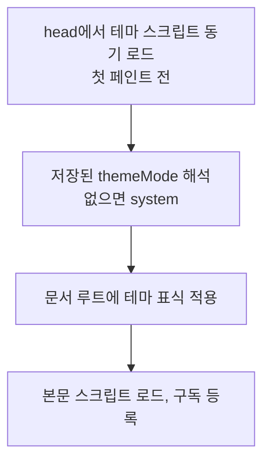
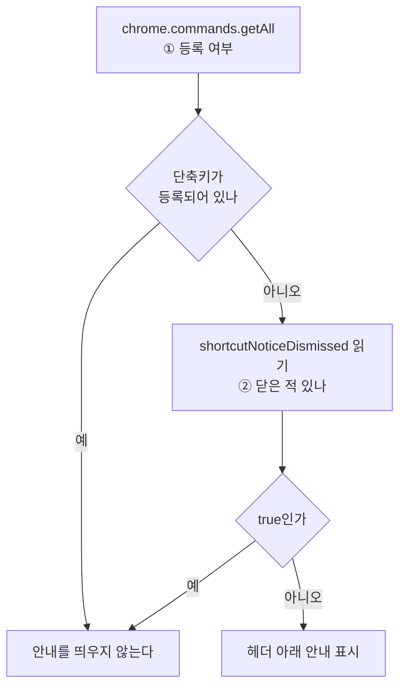

# 6-1. 인터랙션

화면이 **입력을 받고 다시 그릴 때까지의 단계**를 고정한다. 순서를 건너뛰거나 바꾸면 깨지는 지점을 다룬다.

```text
§6-1-1   팝업 렌더          진입에서 카드까지
§6-1-2   검색 입력 처리       입력에서 재렌더까지
§6-1-3   이동 처리           세 입력의 분기
§6-1-4   설정 저장           드래그에서 저장까지
§6-1-5   테마 적용           첫 페인트 전에 끝낸다
§6-1-6   단축키 안내          두 번의 비동기 확인
```

## 6-1-1 팝업 렌더



| 지킬 것 | 어기면 |
| --- | --- |
| 토큰 발급이 `get` 호출보다 먼저다 | 같은 토큰을 두 요청이 나눠 갖는다 |
| 콜백 진입부에서 토큰을 확인하고 즉시 반환한다 | 검색어를 빠르게 칠 때 늦게 도착한 이전 결과가 최신 화면을 덮는다 |
| 없는 id 제외와 중복 제거는 **렌더 단계에서** 한다 | 저장소 값을 고쳐 쓰게 되어, 사용자가 하지 않은 쓰기가 일어난다 |

## 6-1-2 검색 입력 처리



| 키 | 동작 | 동작하지 않는 조건 |
| --- | --- | --- |
| 입력 | 대상은 `userOrder`가 아니라 **전체** | — |
| `Enter` | 첫 결과를 **현재 탭**에서 연다 | 한글 조합 중(`isComposing`). 조합 확정용 `Enter`가 링크를 열면 글자를 지우고 다시 쳐야 한다 |
| `/` | 검색창으로 포커스 이동 | 입력 요소 안이거나 조합 키가 눌린 상태 |
| `1`~`9` | 해당 자리 카드를 연다 | 입력 요소에 포커스가 있거나, `Ctrl`/`Alt`/`Cmd`가 함께 눌렸거나, 키가 눌린 채 반복 중. 검색어에 숫자를 칠 수 없게 되면 안 된다 |

## 6-1-3 이동 처리

카드는 `<a href>`로 만들되 **기본 동작을 막고 확장 API로 연다**. 링크의 기본 동작을 그대로 두면 팝업 화면 자체가 이동한다.

| 이벤트 | 조건 | 호출 | 팝업 |
| --- | --- | --- | --- |
| `click` | 수식 키 없음 | `chrome.tabs.create({ active: true })` | 닫힌다 |
| `click` | `Ctrl`/`Cmd`/`Shift` | `chrome.tabs.create({ active: false })` | 유지 |
| `auxclick` | 휠(가운데) | `chrome.tabs.create({ active: false })` | 유지 |

| 지킬 것 | 왜 |
| --- | --- |
| `auxclick`을 쓴다 | 휠 클릭은 `click`으로 오지 않는다 |
| `href`를 비워두지 않는다 | 값이 있어야 hover에서 주소가 보이고 접근성 트리에 링크로 잡힌다 |
| **현재 탭**은 검색 결과의 `Enter`에서만(`chrome.tabs.update`) | 그 외 경로는 전부 새 탭이다 |

## 6-1-4 설정 저장



| 지킬 것 | 왜 |
| --- | --- |
| **저장은 버튼에서만** 일어난다 | 드래그 도중 저장하면 되돌릴 수 있는 조작과 확정이 섞인다 |
| **순서는 오른쪽 열의 DOM에서** 읽는다 | 검색어·필터는 왼쪽 표시에만 영향을 주므로, 필터가 걸린 상태로 저장해도 결과가 같아야 한다 |
| 링크에서 시작한 드래그는 취소한다 | 링크를 끌었을 뿐인데 항목이 딸려가면 안 된다 |
| 스크롤 영역 가장자리 40px 안에서 자동 스크롤한다 | 이 보조가 없으면 학과 69개 목록에서 상단으로 항목을 옮길 수 없다 |
| 실패를 조용히 넘기지 않는다 | 사용자는 저장되었다고 믿고 페이지를 떠난다 |

## 6-1-5 테마 적용



| 지킬 것 | 왜 |
| --- | --- |
| **표식은 첫 페인트 전에** 붙는다 | 본문 뒤로 미루면 라이트로 한 번 그린 뒤 다크로 바뀌는 깜빡임이 보인다. 테마 스크립트만 `<head>` 동기 로드인 이유다 |
| **서비스 아이콘은 테마 변경을 구독해 경로를 바꾼다** | 이미 그려진 아이콘은 표식만 바꿔서는 따라오지 않는다. 확장과 랜딩이 같다 |
| 랜딩은 **저장이 동기**라 흐름이 한 단계 짧다 | 확장처럼 "먼저 시스템 설정으로 칠하고 저장값이 오면 보정"하는 단계가 없다. 첫 페인트 전에 최종 값을 안다 |
| 구독은 **해지 가능한 다중 구독**이다 | 팝업의 상태 안내와 설정의 라디오·안내가 모두 구독자다. 단일 슬롯이면 나중 등록이 앞 등록을 조용히 덮는다 |
| 저장 실패 시 화면과 컨트롤을 직전 값으로 되돌린다 | 저장소와 화면이 어긋난 채로 남는다 |

## 6-1-6 단축키 안내

비동기 확인을 **두 번 연달아** 한다. 순서를 바꾸면 단축키를 등록한 사용자에게도 저장소를 읽는다.



| 상황 | 동작 |
| --- | --- |
| `chrome.commands?.getAll`이 없는 환경 | **아무것도 하지 않고 반환한다**. 안내가 없는 것이 잘못된 안내보다 낫다 |
| 닫기를 눌렀다 | 즉시 숨기고 `true`를 저장한다. 저장 실패 시 안내를 되돌리고 `#theme-status`로 알린다 |
| `설정에서 지정`을 눌렀다 | `options.html#shortcut-guide`를 새 탭으로 연다. 브라우저 목록은 설정에만 둔다 |
