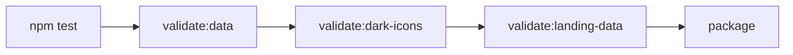

# 6-2. 데이터

`src/data.js`의 `MASTER_SITE_LIST`는 LinKHU에서 가장 자주 바뀌며 오류가 눈에 잘 띄는 자산이다. 서비스 하나라도 스키마를 어기면 팝업에 깨진 아이콘이 뜨거나 랜딩 검색이 어긋난다.

**문서와 검증기가 어긋나면 이 문서가 맞다.** 검증기를 이 문서에 맞춰 고친다. 계약을 바꾸려면 여기를 먼저 고치고 검증기를 따라오게 한다.

현재 간극이 하나 있다. 아래 다섯 필드 규칙 가운데 "그 외 필드를 넣지 않는다"는 규칙을 검증기가 아직 강제하지 못한다.

```text
§6-2-1   스키마            필드와 타입
§6-2-2   필드 규칙          각 필드가 만족해야 할 조건
§6-2-3   컬렉션 규칙        항목 사이의 제약
§6-2-4   아이콘 자산        이미지 파일 배치와 참조
§6-2-5   검증 파이프라인     validate:data와 generate:landing-data
§6-2-6   변경 절차          데이터를 바꿀 때의 순서
§6-2-7   URL 점검 함정      살아 있는 사이트를 죽었다고 오판하지 않기
§6-2-8   수동 관리 숫자      서비스 수가 여러 곳에 흩어져 있는 문제
```

## 6-2-1 스키마

`MASTER_SITE_LIST`는 서비스 객체의 배열이다. 각 객체는 정확히 다섯 개 필드를 갖는다.

```js
{
  id: "info21",                        // 고유 식별자
  name: "인포21",                       // 표시 이름
  url: "https://portal.khu.ac.kr",     // 이동 주소
  imgSrc: "images/common/portal.png",  // 아이콘 경로 (src/ 기준 상대)
  category: "학사·포털",                 // 정해진 여덟 값 중 하나
}
```

**다섯 필드 외의 필드를 추가하지 않는다**. 스키마를 늘리려면 데이터뿐 아니라 이 문서, 검증기, 랜딩 직렬화를 함께 바꿔야 하는 계약 변경으로 다룬다.

현재 검증기는 **필수 필드가 있는지만 확인하고, 정의되지 않은 필드가 섞여 들어와도 잡지 못한다.** 즉 이 규칙은 지금 문서로만 강제된다.

2026-09-01 기준 167개 항목이 있다.

| 카테고리 | 개수 |
| --- | --- |
| 학사·포털 | 11 |
| 생활·복지 | 12 |
| 장학·진로·창업 | 5 |
| 교육·역량 | 16 |
| 캠퍼스·문화 | 11 |
| 대학·행정 | 15 |
| 단과대 | 26 |
| 학과 | 69 |

배열의 **정의 순서에 의미가 있다**. 검색 결과가 동점일 때 이 순서로 정렬된다. 항목을 재배치하면 사용자에게 보이는 검색 결과 순서가 바뀐다.

## 6-2-2 필드 규칙

다섯 필드 모두 **비어 있지 않은 문자열이어야 한다**. 누락, 빈 문자열, 공백만 있는 값은 오류다.

| 필드 | 형식 | 목록 안 중복 | 한 번 배포한 뒤 |
| --- | --- | --- | --- |
| `id` | `/^[a-z0-9-]+$/` — 소문자 영문·숫자·하이픈 | **금지** | **바꾸지 않는다** |
| `name` | 사용자에게 보이는 이름 | **금지** | 자유롭게 고친다 |
| `url` | `https:` 또는 `http:`, 파싱 가능한 주소 | **금지** | HTTPS 지원 여부를 다시 확인 |
| `imgSrc` | `src/` 기준 상대 경로, `.png`·`.jpg`·`.jpeg`·`.svg` | **허용** | 파일이 실재해야 한다 |
| `category` | `SITE_CATEGORIES`의 여덟 값 중 하나 | **허용** | **계약 변경** — 검증기까지 함께 |

표에 담기지 않는 판단 근거가 아래에 있다.

### `id`를 바꾸지 않는 이유

`id`는 사용자의 `userOrder`에 저장되는 값이다. id를 바꾸면 그 서비스를 담아둔 **기존 사용자의 설정에서 항목이 조용히 사라진다.** 렌더링 단계가 `MASTER_SITE_LIST`에 없는 id를 걸러내기 때문이다. 아이콘 파일명을 `id`와 맞추는 것은 권장이지 강제가 아니다.

`name`은 검색 대상이다. 검색이 공백을 제거하고 비교하므로 이름 안의 공백은 검색을 방해하지 않는다.

### `url`의 프로토콜

프로토콜은 취향이 아니라 **대상 사이트가 무엇을 지원하는가**가 정한다.

| 대상 사이트 | 쓸 값 | 검증기 |
| --- | --- | --- |
| HTTPS를 지원한다 | `https://` | 통과 |
| HTTPS 미지원이거나 인증서가 낡아 실패한다 | `http://` | **경고** — 오류가 아니다 |
| 그 밖의 프로토콜 | 쓸 수 없다 | 오류 |
| 파싱할 수 없는 주소 | 쓸 수 없다 | 오류 |

`http://` 경고는 "고쳐야 할 일"이 아니라 **"확인이 필요한 항목"**이라는 표시다. 2026-07-30 기준 16건이며 모두 HTTPS 미지원을 확인한 의도적 잔존이다. 새 항목을 넣거나 주소를 바꿀 때 HTTPS를 지원하는데도 `http://`로 넣으면 경고가 하나 늘어난다. 그러면 확인한 경고와 확인하지 않은 경고를 구분할 수 없다.

**교외 도메인**

목록의 대부분은 `khu.ac.kr`이지만 등록 기준은 아니다. 1-1 제품 정의가 말하는 **"경희대학교 구성원이 자주 쓰는가"**가 기준이다. 도메인은 판단 근거가 아니라 결과다.

- **경희대 구성원이 학기 중 반복해서 쓰는 서비스면 교외 도메인도 등록한다**. 다만 그 근거를 항목 주석이나 PR에 남긴다 — 다음 사람이 "왜 얘만 밖이지"를 다시 묻지 않게 한다.
- **경희대와 무관한 학생 일반 서비스는 등록하지 않는다**. "학생이 쓰니까"는 기준이 아니다. 그 선을 놓으면 목록이 링크 모음으로 흘러간다.

2026-09-01 기준 교외 도메인은 셋이다.

| id | 도메인 | 근거 |
| --- | --- | --- |
| `everytime` | `everytime.kr` | 학교 커뮤니티가 사실상 이곳에 있다 |
| `khcu-portal` | `portal.khcu.ac.kr` | 학점교류로 경희사이버대 강의를 듣는 학생이 학기 내내 쓴다 |
| `khcu-lms` | `lms.khcu.ac.kr` | 위와 같다 |

경희사이버대는 경희대와 **별개 법인**이다. 재단이 같을 뿐 학번·포털·학사 시스템이 분리되어 있다. 그럼에도 등록하는 것은 학점교류 수강생에게 이 두 사이트가 교내 서비스와 같은 빈도로 쓰이기 때문이다. **법인이 같아서가 아니라 우리 학생이 써서 넣는다.**

### `imgSrc`

값은 `images/common/portal.png`처럼 `src/`를 기준으로 한 상대 경로다. PNG를 권장한다.

- **`src/` 바깥을 가리킬 수 없다**. `../`로 벗어나는 경로와 절대 경로는 오류다.
- **여러 서비스가 같은 아이콘을 공유해도 된다**. 전용 도안이 없는 학과가 공통 아이콘을 쓰는 경우가 있다. 그래서 중복 제약이 없다.

### `category`

단일 소스는 `src/data.js`의 카테고리 목록이다. 설정 페이지의 영역과 필터 버튼을 이 목록에서 만들어 내므로 값을 추가하면 화면이 따라오고, **목록 순서가 곧 설정 페이지의 영역 순서**다.

| 헷갈리기 쉬운 것 | 사실 |
| --- | --- |
| 카테고리를 늘리는 것 | **계약 변경이다**. 데이터·`SITE_CATEGORIES`·검증기(`ALLOWED_CATEGORIES`)·문서를 한 번에 바꾼다. 배포된 값을 바꾸면 팝업 검색의 카테고리 매칭도 달라진다 |
| 카테고리와 기본 목록 | **다른 것이다.** 어떤 카테고리에 속한다는 이유로 처음부터 담기지 않는다 |
| 카테고리와 아이콘 폴더 | **유도하지 않는다**. `imgSrc`가 경로를 통째로 갖는다. `images/common`·`colleges`·`departments`는 파일을 나눠 담는 관례일 뿐이다 |

## 6-2-3 컬렉션 규칙

| 항목 | 제약 |
| --- | --- |
| `id` | 중복 불가 (오류) |
| `name` | 중복 불가 (오류) |
| `url` | 중복 불가 (오류) |
| `imgSrc` | 중복 허용 |

**쓰이지 않는 서비스 이미지가 있으면 오류다**. `src/images/common`, `src/images/colleges`, `src/images/departments` 안의 이미지 파일 중 어떤 서비스의 `imgSrc`도 가리키지 않는 것이 있으면 검증이 실패한다. 서비스를 지우면서 아이콘을 남기면 이 규칙에 걸린다. 아이콘도 함께 지운다.

### 기본 목록

사용자가 설정을 저장한 적이 없을 때 보이는 목록이다. `src/shared.js`의 `LinKHUShared.DEFAULT_SITE_IDS`가 단일 소스다.

```text
info21  ecampus  everytime  notice  library
scholarship  intern  sugang  chatkhu  ois
```

- 기본 목록은 **데이터가 아니라 코드 상수로 둔다**. §6-2-1의 5필드 스키마를 유지해야 하므로 항목마다 `isDefault` 같은 필드를 붙이지 않는다.
- 표시 순서는 상수의 나열 순서가 아니라 **이름 `localeCompare("ko-KR")` 가나다순**이다. 설정 페이지 왼쪽 목록과 같은 기준이라 두 화면의 순서 감각이 어긋나지 않는다. 영문 이름의 위치도 `localeCompare`가 정하는 대로 둔다.
- `DEFAULT_SITE_IDS`에 있지만 `MASTER_SITE_LIST`에 없는 id는 조용히 빠진다. 서비스를 지워도 기본 목록이 깨지지 않아야 한다.
- 기본 목록을 바꿔도 **이미 저장된 `userOrder`에는 영향이 없다**. 폴백은 저장된 값이 없을 때만 쓰인다.

## 6-2-4 아이콘 자산

서비스 아이콘은 카테고리별 폴더에 둔다.

```text
src/images/common/        공통 서비스
src/images/colleges/      단과대
src/images/departments/   학과
```

확장 프로그램 자체 아이콘(`src/icons/icon16.png`, `icon48.png`, `icon128.png`)은 서비스 아이콘과 별개이며 위 검증 대상이 아니다. `icon48.png`는 서비스 아이콘 로딩이 실패했을 때의 대체 이미지로도 쓰인다.

아이콘 자체의 도안 규칙과 두 벌 체계는 이 문서가 다루지 않는다.

## 6-2-5 검증 파이프라인

### `npm run validate:data`

`src/data.js`를 격리된 컨텍스트에서 평가해 `MASTER_SITE_LIST`를 읽고 §6-2-2, §6-2-3의 규칙을 검사한다.

- 검사 결과를 **오류**와 **경고**로 나눠 출력한다.
- 오류가 하나라도 있으면 종료 코드가 0이 아니다. 경고는 종료 코드에 영향을 주지 않는다.
- 현재 `http://` URL만 경고로 분류된다.

### `npm run generate:landing-data`

`MASTER_SITE_LIST`에서 랜딩용 산출물 두 가지를 만든다.

| 산출물 | 내용 |
| --- | --- |
| `landing/assets/services.json` | `id`, `name`, `url`, `category`, `imgSrc` 직렬화 (들여쓰기 2, 끝에 개행) |
| `landing/assets/images/**` | `src/images/`에서 실제 쓰이는 아이콘만 복사 |

쓰이지 않게 된 아이콘 복사본은 삭제한다. 이 산출물은 **생성물이므로 직접 수정하지 않는다**.

### `npm run validate:landing-data`

같은 스크립트를 `--check` 모드로 실행한다. `services.json`이 최신인지, 아이콘 복사본이 원본과 바이트 단위로 같은지 확인하고, 어긋나면 실패하면서 `npm run generate:landing-data` 실행을 안내한다.

### `npm run build`에서의 순서



데이터를 바꾸고 랜딩 산출물 생성을 잊으면 `validate:landing-data`에서 막힌다. CI가 같은 명령을 실행하므로 로컬에서 잊어도 PR에서 걸린다.

## 6-2-6 변경 절차

데이터를 바꿀 때는 다음 순서를 따른다.

1. `src/data.js`를 수정한다. 아이콘을 추가한다면 카테고리 폴더에 함께 넣는다.
2. `npm run generate:landing-data`를 실행해 랜딩 산출물을 갱신한다.
3. `npm run validate:data`를 실행하고 **결과를 PR 본문에 남긴다**.
4. 팝업과 설정 페이지에서 항목이 정상 표시되는지 확인한다 (7-2 테스트 케이스).

서비스를 **삭제**할 때는 추가로 확인한다.

- 아이콘 파일은 **다른 서비스가 그 파일을 참조하지 않을 때만 지운다**. 아이콘은 공유될 수 있으므로, 확인 없이 지우면 남아 있는 서비스의 아이콘이 깨진다. 2026-07-30 기준 `images/common/khu.png`를 세 서비스가 공유하고 있다.
- 아무도 참조하지 않게 된 아이콘은 지운다. 남기면 "쓰이지 않는 이미지" 오류가 난다.
- 두 조건은 `npm run validate:data`로 함께 확인된다. 파일을 지웠는데 다른 서비스가 참조하면 "파일이 존재하지 않음" 오류가, 안 지웠는데 아무도 안 쓰면 "쓰이지 않는 이미지" 오류가 난다. **어느 쪽이든 검증에서 걸리므로, 판단이 서지 않으면 검증을 돌려 확인한다.**
- 그 서비스를 담아둔 기존 사용자의 `userOrder`에는 삭제된 id가 남는다. 렌더링 단계에서 걸러지므로 화면은 깨지지 않는다.

## 6-2-7 URL 점검 함정

주기적으로 링크가 살아 있는지 확인해야 하지만, 응답만 보고 판단하면 **멀쩡한 사이트를 죽었다고 오판하기 쉽다.** 실제로 다음 함정들이 확인되었다.

- **봇 차단과 로그인 페이지를 "접속 불가"로 읽지 않는다**. 자동 요청을 막거나 로그인 화면으로 보내는 것은 정상 동작이다. **교체 대상은 명시적인 404뿐이다.**
- **TLS가 낡아 HTTPS만 실패하는 사이트가 있다.** HTTP로는 정상 접속되는 경우이며, 이런 항목은 `http://`로 유지한다. `http://` 경고가 남아 있는 항목들은 대부분 이 경우다 — 즉 **경고는 처리하지 않은 일이 아니라 의도된 잔존이다.**
- **학과 홈페이지 주소는 이전되는 경우가 있다.** 개별 도메인을 쓰던 학과가 학교 통합 도메인의 하위 경로로 옮겨간 사례가 있다. 접속이 안 되면 폐쇄로 단정하기 전에 통합 도메인 쪽을 먼저 확인한다.
- 판단이 서지 않으면 **바꾸지 않고 보류한다**. 살아 있는 링크를 잘못 교체하면 사용자가 엉뚱한 곳으로 간다. 되돌리기보다 미루는 쪽이 안전하다.

URL을 실제로 바꿀 때는 새 주소의 응답을 직접 확인하고 결과를 PR 본문에 남긴다.

## 6-2-8 수동 관리 숫자

지원 서비스 수는 데이터에서 계산되는 값이지만, 홍보 문구로서 여러 문서에 **손으로 적혀 있다.** README, 랜딩 페이지, 지원 서비스 목록 문서가 각각 숫자를 갖고 있다.

서비스를 추가·삭제하면 이 숫자들이 조용히 어긋난다. 검증 스크립트는 데이터만 보므로 이 불일치를 잡지 못한다.

- 서비스를 추가하거나 삭제하는 PR은 **문서에 적힌 서비스 수도 함께 갱신한다**.
- 기준값은 문서가 아니라 `src/data.js`다. 숫자가 서로 다르면 데이터를 세어 맞춘다.
- 카테고리별 개수는 검증 스크립트의 로더로 데이터를 읽어 세면 정확하게 얻을 수 있다.
