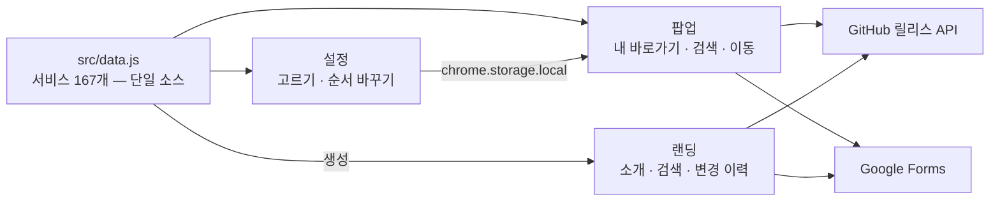

# LinKHU 스펙 문서

LinKHU는 경희대학교 주요 웹서비스 바로가기를 제공하는 브라우저 확장 프로그램이다.

이 폴더가 **저장소의 유일한 문서 원본**이다. 배경·요구사항·설계·계약·구현 규약·운영을 번호 계층으로 담고, 결정의 배경과 대안은 [`DECISIONS.md`](DECISIONS.md)가 로그로 따로 쌓는다. "어떻게 일하는가"(이슈·브랜치·커밋·PR 절차)는 [`AGENTS.md`](../../AGENTS.md)가 원본이며 여기서 반복하지 않는다. 릴리스·스토어 제출·아이콘·스크린샷 같은 운영 규격도 모두 이 안의 번호 계층에 있다.

## 전체 그림



화면 셋이 같은 데이터를 보고, 설정이 정한 순서를 팝업이 읽는다. 바깥으로 나가는 호출은 둘뿐이고 둘 다 실패해도 바로가기는 열린다.

## 스펙이 정본이다

**이 문서만 보고 구현해도 지금과 같은 것이 나와야 한다.** 코드가 먼저 있고 문서가 그것을 옮겨 적는 것이 아니라, 여기서 설계하고 코드가 그것을 따른다. 내부 변수 이름처럼 구현이 알아서 정할 것은 달라도 되지만, **기능·화면 치수·디자인 규칙·처리 순서는 여기에 다 있어야 한다.**

- **자연어로 적는다.** CSS 속성이나 함수 시그니처를 옮겨 적지 않는다. 무엇을 왜 그렇게 정했는지를 쓰고, 그 판단의 결과로 나오는 값을 문장 안에 담는다.
- **문서와 코드가 어긋나면 이 문서가 맞다.** 코드를 고친다. 결정을 바꾸려는 것이라면 문서를 먼저 고치고 구현을 맞춘다.
- **아직 없는 것은 쓰지 않는다**. 검토 중인 방향, 후속 과제, 미정 사항은 스펙이 아니라 이슈에 남긴다. 확정되고 구현되면 그때 이 문서에 들어온다. 결정되지 않은 것을 적어 두면 읽는 사람도 에이전트도 무엇을 따라야 할지 알 수 없다.
- **측정 가능하게 적는다.** "적절한 대비"가 아니라 "4.5:1 이상", "적당한 여백"이 아니라 "20px"처럼 확인할 수 있어야 한다. 값을 적지 않으면 구현할 때 다시 정하게 된다.
- **영역 배치는 그림이 아니라 표로 적는다.** 선으로 그린 상자는 한글과 영문의 글자 폭이 다른 폰트에서 세로 선이 어긋나, 읽는 환경에 따라 깨진 그림이 된다.
- **문장은 규칙 그대로 쓴다.** `MUST`·`SHOULD` 같은 표기를 붙이지 않는다. "~한다"로 적은 것은 지키는 것이고, 재량이 있으면 "~해도 된다"로 적는다.
- 구현과 스펙은 **같은 PR에서 함께** 바꾼다. 그래서 `main`의 스펙과 `main`의 코드는 언제나 같은 것을 말한다.

## 번호는 층위다

**번호가 작을수록 위다. 위가 바뀌면 아래를 전부 바꾸고, 아래는 위를 바꾸지 못한다**.

| 층 | 무엇을 정하는가 |
| --- | --- |
| 1 | 제품이 무엇이고 어디까지가 범위인가 |
| 2 | 사용자와 운영자가 무엇을 할 수 있어야 하는가 |
| 3 | 제품이 다루는 단위와 각 화면이 보여주는 범위 |
| 4 | 그것을 어떤 화면·조각·상태로 만드는가 |
| 5 | 바깥과 무엇을 주고받기로 약속했는가 |
| 6 | 그 약속을 어떤 순서와 규약으로 구현하는가 |
| 7 | 실패·검증·배포를 어떻게 다루는가 |

**파일명은 층에 문서가 하나면 `N`, 둘 이상이면 `N-M`이다**. 지금 `1`·`3`·`5`가 하나이고 나머지는 둘 이상이다. 문서가 늘어 쪼개질 때 비로소 `N-1`·`N-2`를 붙이고, 그때 바깥 링크를 함께 고친다.

이 층위를 왜 이렇게 잡았는지는 DECISIONS 6-2에 있다.

이 방향이 리뷰 순서이기도 하다. 위 문서부터 합의하고 아래로 내려간다. **아래를 고치려다 위를 고쳐야 한다면 그건 위쪽 설계가 틀렸다는 신호다** — 아래에 맞춰 위를 주무르지 말고, 위가 왜 틀렸는지부터 본다.

예를 들어 카테고리를 하나 늘리는 변경은 3층이므로 4층(설정 화면 영역·필터 칩), 6층(데이터 계약·검증기), 7층(테스트)이 함께 움직인다. 반대로 카드 여백을 조정하는 변경은 4층이라 위로 올라가지 않는다.

## 읽는 순서

```text
1     BACKGROUND               제품 정의, 문제와 가치, 범위, 기술 스택, 용어
2-1   USER-STORIES             학생 사용자가 무엇을 하려고 하는가
2-2   OPERATOR-REQUIREMENTS    메인테이너가 무엇을 유지해야 하는가
3     INFORMATION-ARCHITECTURE 다루는 단위, 카테고리, 화면별 범위, 검색 범위
4-1   LAYOUT                   화면 영역, 설정 목록 격자, 팝업 카드 이름
4-2   UI-SYSTEM                공식 색상표, 디자인 토큰, UI 아이콘, 다크 테마
4-3   SOFTWARE-ARCHITECTURE    3개 화면 경계, 스크립트 결합, 공용 유틸
4-4   STATE                    저장 키, 사용자 설정과 캐시, 비동기 렌더
4-5   SERVICE-ICON             팔레트, 두 벌 체계, 생성기, 추가 절차
4-6   SCREENSHOT               세 장의 규격, 촬영 방식, 개인정보 처리
5     CONTRACT                 랜딩 파생 산출물, GitHub API, Google Forms
6-1   INTERACTION              렌더·검색·이동·저장·테마·안내의 실행 순서
6-2   DATA                     MASTER_SITE_LIST 스키마, 검증 파이프라인
7-1   ERROR-HANDLING           실패 상황에서의 동작 규약
7-2   TEST-CASES               자동 테스트, 수동 검증 매트릭스, 특별 검증
7-4   DEPLOYMENT               배포 경로와 자동화 경계, CI, 랜딩 배포
7-5   RELEASE                  버전 자리, 준비 PR, 태그 push, 릴리스 후 공지
7-6   STORE                    세 스토어 제출, 자격 증명, 실패 대응

DECISIONS                      왜 그렇게 정했는가 (로그, 덧붙이기만 한다)
```

**7-3 관측은 결번이다.** LinKHU는 텔레메트리, 분석 SDK, 원격 로그 수집을 두지 않으므로 관측할 수단 자체가 없다. 번호를 당기지 않고 비워 둔다 — 층위 번호를 옮기면 바깥 링크가 전부 깨지고, 빈 자리가 "없다"는 사실을 남긴다. 근거는 [DECISIONS 1-3](DECISIONS.md#d-1-3)이다.

## 문서와 책임

| 문서 | 책임 |
| --- | --- |
| [1-BACKGROUND.md](1-BACKGROUND.md) | 제품이 무엇이고 어디까지가 범위인지, 어떤 기술 위에 서 있는지 |
| [2-1-USER-STORIES.md](2-1-USER-STORIES.md) | 학생 사용자의 핵심 사용 사례와 완료 조건 |
| [2-2-OPERATOR-REQUIREMENTS.md](2-2-OPERATOR-REQUIREMENTS.md) | 데이터 갱신, 릴리스, 스토어 배포, 문의 대응, 기여 관리 |
| [3-INFORMATION-ARCHITECTURE.md](3-INFORMATION-ARCHITECTURE.md) | 서비스 단위, 카테고리 8개, 화면별 노출 범위, 기본 목록, 검색 순위 |
| [4-1-LAYOUT.md](4-1-LAYOUT.md) | 팝업·설정 영역 순서, 격자 열 수, 카드 폭 계산과 줄바꿈 표 |
| [4-2-UI-SYSTEM.md](4-2-UI-SYSTEM.md) | 공식 색상표와 대비 실측, 토큰 SSOT, 확장-랜딩 우선순위, UI 아이콘, 다크 테마 |
| [4-3-SOFTWARE-ARCHITECTURE.md](4-3-SOFTWARE-ARCHITECTURE.md) | 3개 화면 경계, 스크립트 로드 순서와 전역, 공용 유틸 |
| [4-4-STATE.md](4-4-STATE.md) | 저장 키 다섯, 사용자 설정과 캐시의 구분, 렌더 토큰 |
| [4-5-SERVICE-ICON.md](4-5-SERVICE-ICON.md) | 서비스 아이콘 팔레트, 두 벌 체계, 생성기와 검증, 추가 절차 |
| [4-6-SCREENSHOT.md](4-6-SCREENSHOT.md) | 세 장의 규격과 촬영 방식, 포털 촬영 시 개인정보 처리 |
| [5-CONTRACT.md](5-CONTRACT.md) | 랜딩 파생 산출물, GitHub 릴리스 API, Google Forms, 공통 원칙 |
| [6-1-INTERACTION.md](6-1-INTERACTION.md) | 렌더·검색·이동·저장·테마·단축키 안내의 실행 순서 |
| [6-2-DATA.md](6-2-DATA.md) | `MASTER_SITE_LIST` 스키마, 필드 규칙, 검증·생성 스크립트 계약 |
| [7-1-ERROR-HANDLING.md](7-1-ERROR-HANDLING.md) | 데이터·저장소·네트워크·자산 실패 시의 동작 |
| [7-2-TEST-CASES.md](7-2-TEST-CASES.md) | `npm test` 범위, 수동 검증 매트릭스, 검증 환경, 특별 검증 절차 |
| [7-4-DEPLOYMENT.md](7-4-DEPLOYMENT.md) | 배포 4경로와 자동화 경계, CI 검증, 랜딩 배포 |
| [7-5-RELEASE.md](7-5-RELEASE.md) | 버전 자리 판단, 준비 PR과 태그 순서, 릴리스 후 공지 |
| [7-6-STORE.md](7-6-STORE.md) | 세 스토어 제출 절차, 자격 증명, Chrome 실패 대응 |
| [DECISIONS.md](DECISIONS.md) | 결정 21건의 배경·대안·채택·영향 |

## 코드와 스펙의 대응

어떤 파일을 고칠 때 어떤 문서를 함께 봐야 하는지를 고정한다. **코드를 바꾸면 여기 짝지어진 문서를 같은 PR에서 갱신한다**.

| 코드 | 스펙 |
| --- | --- |
| `src/manifest.json` | [1-BACKGROUND](1-BACKGROUND.md), [7-4](7-4-DEPLOYMENT.md), [DECISIONS 1-2](DECISIONS.md#d-1-2)·[1-3](DECISIONS.md#d-1-3) |
| `src/data.js` | [3](3-INFORMATION-ARCHITECTURE.md), [6-2](6-2-DATA.md) |
| `src/shared.js` | [3-4](3-INFORMATION-ARCHITECTURE.md)·[3-5](3-INFORMATION-ARCHITECTURE.md), [4-3-3](4-3-SOFTWARE-ARCHITECTURE.md), [4-1-4](4-1-LAYOUT.md) |
| `src/popup.js` / `popup.html` / `popup.css` | [4-1-1](4-1-LAYOUT.md), [6-1-1](6-1-INTERACTION.md)~[6-1-3](6-1-INTERACTION.md), [6-1-6](6-1-INTERACTION.md) |
| `src/options.js` / `options.html` / `options.css` | [4-1-2](4-1-LAYOUT.md)·[4-1-3](4-1-LAYOUT.md), [6-1-4](6-1-INTERACTION.md) |
| `src/theme.js` / `theme.css` | [4-2-2](4-2-UI-SYSTEM.md)·[4-2-5](4-2-UI-SYSTEM.md), [6-1-5](6-1-INTERACTION.md) |
| `src/version.js` | [4-4-2](4-4-STATE.md), [5-2](5-CONTRACT.md), [DECISIONS 3-1](DECISIONS.md#d-3-1) |
| `src/feedback.js` | [5-3](5-CONTRACT.md), [DECISIONS 1-5](DECISIONS.md#d-1-5) |
| `src/images/**` | [4-5](4-5-SERVICE-ICON.md) |
| `landing/assets/screenshots/**` | [4-6](4-6-SCREENSHOT.md) |
| `landing/**` | [3-3](3-INFORMATION-ARCHITECTURE.md), [5-1](5-CONTRACT.md), [DECISIONS 5-1](DECISIONS.md#d-5-1)·[5-3](DECISIONS.md#d-5-3) |
| `scripts/validate-data.js` | [6-2-5](6-2-DATA.md), [4-1-4](4-1-LAYOUT.md) |
| `scripts/generate-landing-data.js` | [5-1](5-CONTRACT.md), [6-2-5](6-2-DATA.md) |
| `scripts/generate-dark-icons.js` | [4-5-4](4-5-SERVICE-ICON.md), [DECISIONS 4-2](DECISIONS.md#d-4-2) |
| `scripts/package-extension.js` / `validate-release.js` | [7-5](7-5-RELEASE.md)·[7-6](7-6-STORE.md), [DECISIONS 3-2](DECISIONS.md#d-3-2) |
| `tests/**` | [7-2](7-2-TEST-CASES.md) |
| `.github/workflows/**` | [7-4-2](7-4-DEPLOYMENT.md), [7-5-3](7-5-RELEASE.md), [7-6](7-6-STORE.md) |

## 변경 원칙

1. **스펙이 먼저다.** 구현 PR은 관련 스펙 문서를 먼저 갱신하거나, 스펙과 구현을 **같은 PR에서 함께** 바꾼다. 스펙 없이 구현부터 하고 문서를 나중에 맞추지 않는다.
2. **위 번호를 고쳤으면 아래를 전부 훑는다**. 위가 바뀌면 아래가 따라오고, 아래 때문에 위를 고쳐야 한다면 위쪽 설계를 먼저 의심한다.
3. 코드를 바꾸면 위 대응표에서 짝지어진 문서를 **같은 PR에서** 갱신한다. 문서 갱신을 후속 PR로 미루지 않는다.
4. **문서와 코드가 어긋나면 코드가 사실이다**. 문서를 고친다. 계약을 바꾸려는 것이라면 스펙과 구현을 같은 PR에서 함께 바꾼다.
5. 같은 내용을 두 곳에 쓰지 않는다. 아래 원본 표에서 그 주제의 원본을 확인하고, 다른 문서에서는 번호로 가리킨다.
6. 설계 방향을 바꾸는 판단은 [`DECISIONS.md`](DECISIONS.md)에 배경·대안·채택·영향과 함께 남긴다. 스펙에는 결과만 쓰고 앵커로 링크한다.

## 주제별 원본

같은 주제가 여러 문서에 흩어지기 쉬운 항목의 원본을 고정한다. **원본에만 절차와 규칙을 쓰고, 다른 곳에서는 링크한다**.

| 주제 | 원본 | 다른 문서의 역할 |
| --- | --- | --- |
| 이슈·브랜치·커밋·PR 절차 | [`AGENTS.md`](../../AGENTS.md) | 반복하지 않음 |
| 카테고리 목록과 화면별 노출 범위 | [3](3-INFORMATION-ARCHITECTURE.md) | `4-1`은 배치만, `6-2`는 형식만 |
| 데이터 스키마·필드 규칙·삭제 절차 | [6-2](6-2-DATA.md) | `2-2`는 운영자 판단 지점만 |
| 검증·생성 스크립트 실행 순서 | [6-2](6-2-DATA.md) | `7-4`는 CI에서 언제 도는지만 |
| 저장 키와 저장 시점 | [4-4](4-4-STATE.md) | `6-1`은 호출 순서만 |
| 외부 호출 계약 | [5](5-CONTRACT.md) | `7-1`은 실패 시 화면 동작만 |
| 색상 값·토큰 계약 | [4-2](4-2-UI-SYSTEM.md) | 다른 문서는 참조만 |
| 카드 폭 계산과 줄바꿈 표 | [4-1-4](4-1-LAYOUT.md) | `6-2`는 검증기 동작만 |
| 릴리스 실행 절차 | [7-5](7-5-RELEASE.md) | `2-2`는 판단 지점, `7-4`는 자동화 경계 |
| 스토어 제출 절차 | [7-6](7-6-STORE.md) | `7-4`는 경로와 자동화 범위 |
| 서비스 아이콘 규칙 | [4-5](4-5-SERVICE-ICON.md) | `4-2-4`는 UI 아이콘만 |
| 스크린샷 규격 | [4-6](4-6-SCREENSHOT.md) | 다른 문서는 참조만 |
| 수동 검증 항목 | [7-2](7-2-TEST-CASES.md) | `AGENTS.md`의 기준을 화면 단위로 구체화 |
| 결정의 배경과 대안 | [DECISIONS](DECISIONS.md) | 다른 문서는 결과만 쓰고 링크 |
